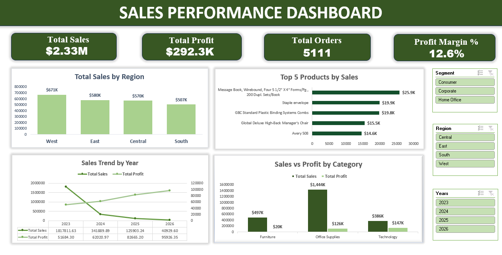

# 📊 Excel Data Analytics — Superstore Sales Project

An end-to-end Excel analytics project built on the **Superstore** retail dataset that moving from raw, messy data through pivot tables, lookup formulas, and calculated fields, to a fully interactive sales dashboard with conditional formatting.

---

## 🗂️ Dataset

| Sheet | Description |
|---|---|
| **Orders** | Order-level transactions: dates, customer, region, product, sales, quantity, discount, profit |
| **Products** | Product catalog with supplier, unit cost, and target margin |
| **People** | Regional managers mapped to each sales region |
| **Returns** | Order IDs that were returned |

---

## ✅ Checkpoint 1 — Data Cleaning 
`Checkpoint-1.xlsx`

- Removed duplicate rows using Excel's built-in duplicate removal (10 duplicates found and removed).
- Deleted a completely blank row (row 1872).
- Fixed inconsistent data types:
  - `Order Date` — was stored as **Text**, converted to **Short Date**.
  - `Ship Date` — already correctly formatted as Date.
  - `Unit Cost`, `Sales`, `Quantity`, `Discount` — were **General**, converted to **Number**.
- Standardized formatting across the sheet:
  - Unified font to **Calibri**, size **11** (previously mixed with Times New Roman and inconsistent sizes).
  - Applied **AutoFit** to all column widths.
  - **Bolded** all column headers.

---

## ✅ Checkpoint 2 — Pivot Tables 
`Checkpoint-2.xlsx`

Five business questions answered using PivotTables:

**1. Which product sub-category generates the highest total sales?**
Sub-Category in Rows, Sum of Sales in Values, sorted descending → **Chairs** ranked highest, followed by Phones and Storage.

**2. Which product category generates the highest profit in each region?**
Segment as filter, Category in Rows, Region in Columns, Sum of Profit in Values → **Technology** is the most profitable category in every region.

**3. Which customer segment receives the highest average discount?**
Region as filter, Segment in Rows, Average of Discount in Values → **Consumer** and **Corporate** receive the highest average discount (0.16), **Home Office** slightly lower (0.15).

**4. How do sales and profit compare across different shipping modes?**
Region as filter, Category in Rows, Ship Mode in Columns, Sum of Sales + Sum of Profit in Values → **Standard Class** generates the highest sales and profit across all categories.

**5. How have sales and profit changed across regions over the years?**
Order Date grouped by Year, Segment as filter, Years in Rows, Region in Columns, Sum of Sales + Sum of Profit in Values → Sales and profit generally trended upward, with **2026** the strongest year on record.

---

## ✅ Checkpoint 3 — Lookup Formulas 
`Checkpoint-3.xlsb`

Combined data from `People` and `Products` into the `Orders` sheet using both **INDEX-MATCH** and **XLOOKUP**, plus a **VLOOKUP** to flag returns:

| New Column | Method | Formula |
|---|---|---|
| Regional Manager | INDEX-MATCH | `=INDEX(People!$A$2:$A$5,MATCH(M2,People!$B$2:$B$5,0))` |
| Regional Manager | XLOOKUP | `=XLOOKUP(M2,People!$B:$B,People!$A:$A,"Not Found")` |
| Supplier | INDEX-MATCH | `=INDEX(Products!$C:$C,MATCH(N2,Products!$A:$A,0))` |
| Unit Cost | INDEX-MATCH | `=INDEX(Products!$D:$D,MATCH(N2,Products!$A:$A,0))` |
| Returned | VLOOKUP | `=IFERROR(VLOOKUP(B2,Returns!$A:$B,2,FALSE),"No")` |
| Target Margin | XLOOKUP | `=XLOOKUP(N2,Products!$A:$A,Products!$E:$E,"Not Found")` |

Both INDEX-MATCH and XLOOKUP were used for the Regional Manager column to demonstrate two equivalent lookup approaches — they returned identical results.

---

## ✅ Checkpoint 4 — Calculated Fields 
`Checkpoint-4.xlsb`

**IF / Nested IF / IFS classifications:**

| New Column | Logic | Formula |
|---|---|---|
| Profit Status | Profitable vs. Loss | `=IF(U2>0,"Profitable","Loss")` |
| Discount Level | No Discount / Low / Medium / High | `=IF(T2=0,"No Discount",IF(T2<=0.1,"Low",IF(T2<=0.2,"Medium","High")))` |
| Margin Category | Low / Medium / High Margin | `=IFS(AB2<0.2,"Low Margin",AB2<0.3%,"Medium Margin",AB2>=0.3%,"High Margin")` |

**SUMIFS / COUNTIFS summary table (by region):**

| Metric | Formula (example: West) |
|---|---|
| Total Sales by Region | `=SUMIFS(Orders!$R:$R,Orders!$M:$M,"West")` |
| Returned Orders by Region | `=COUNTIFS(Orders!M:M,"West",Orders!AA:AA,"Yes")` |

Same formulas repeated for East, Central, and South by swapping the region criterion.

> ⚠️ **Quality check applied:** confirmed that SUMIFS/COUNTIFS criteria ranges and sum range were the same size — a mismatch here silently returns 0 instead of an error.

---

## ✅ Checkpoint 5 — Interactive Dashboard 
`Checkpoint-5.xlsb`

Built using PivotTables, PivotCharts, KPI cards, Slicers, and Conditional Formatting.

**KPI Cards**

| KPI | Value | Formula |
|---|---|---|
| Total Sales | $2.33M | `=SUM(Orders!R:R)` |
| Total Profit | $292K | `=SUM(Orders!U:U)` |
| Total Orders | 10,194 | `=COUNTA(Orders!B:B)-1` |

**Charts (4 types)**

| Chart | Type | Insight |
|---|---|---|
| Total Sales by Region | Clustered Column | West generated the highest sales, South the lowest |
| Top 5 Products by Sales | Horizontal Bar | Highlights the best-performing products by revenue |
| Sales Trend by Year | Line | Sales grew significantly from 2024 to 2026 |
| Sales Distribution by Category | Pie | Technology holds the largest share of total sales |

**Slicers** — Segment, Region, and Years, all connected to the PivotCharts for interactive filtering.

**Conditional Formatting**

- **Profit** → Green (profitable) / Red (loss)
- **Unit Cost** → Data Bars, longer bar = higher cost
- **Discount Level** → Green (No Discount), Yellow (Medium), Red (High)

---

## ✅ Checkpoint 6 — Formula Documentation 

This README serves as the formula documentation, consolidating every formula used across the project:

| Purpose | Formula |
|---|---|
| Regional Manager (INDEX-MATCH) | `=INDEX(People!$A$2:$A$5,MATCH(M2,People!$B$2:$B$5,0))` |
| Regional Manager (XLOOKUP) | `=XLOOKUP(M2,People!$B:$B,People!$A:$A,"Not Found")` |
| Supplier (INDEX-MATCH) | `=INDEX(Products!$C:$C,MATCH(N2,Products!$A:$A,0))` |
| Unit Cost (INDEX-MATCH) | `=INDEX(Products!$D:$D,MATCH(N2,Products!$A:$A,0))` |
| Returned (VLOOKUP) | `=IFERROR(VLOOKUP(B2,Returns!$A:$B,2,FALSE),"No")` |
| Target Margin (XLOOKUP) | `=XLOOKUP(N2,Products!$A:$A,Products!$E:$E,"Not Found")` |
| Profit Status (IF) | `=IF(U2>0,"Profitable","Loss")` |
| Discount Level (Nested IF) | `=IF(T2=0,"No Discount",IF(T2<=0.1,"Low",IF(T2<=0.2,"Medium","High")))` |
| Margin Category (IFS) | `=IFS(AB2<0.2,"Low Margin",AB2<0.3%,"Medium Margin",AB2>=0.3%,"High Margin")` |
| Total Sales by Region (SUMIFS) | `=SUMIFS(Orders!$R:$R,Orders!$M:$M,"West")` |
| Returned Orders by Region (COUNTIFS) | `=COUNTIFS(Orders!M:M,"West",Orders!AA:AA,"Yes")` |
| Total Sales KPI | `=SUM(Orders!R:R)` |
| Total Profit KPI | `=SUM(Orders!U:U)` |
| Total Orders KPI | `=COUNTA(Orders!B:B)-1` |

---

## 🛠️ Skills Demonstrated

- Data cleaning: duplicates, blank rows, inconsistent formats/fonts
- PivotTables & PivotCharts for multi-dimensional business analysis
- Lookup formulas: `VLOOKUP`, `XLOOKUP`, `INDEX-MATCH`
- Calculated fields: `IF`, nested `IF`, `IFS`, `SUMIFS`, `COUNTIFS`
- Dashboard design: KPI cards, slicers, conditional formatting
- Working with the Excel Binary Workbook (`.xlsb`) format for larger files

---

## 📎 Project Structure

| File | Checkpoint |
|---|---|
| `Checkpoint-1.xlsx` | 1 — Data cleaning |
| `Checkpoint-2.xlsx` | 2 — Pivot tables |
| `Checkpoint-3.xlsb` | 3 — Lookup formulas |
| `Checkpoint-4.xlsb` | 4 — Calculated fields |
| `Checkpoint-5.xlsb` | 5 — Dashboard & conditional formatting |
| `Screenshot.png` | Dashboard preview |

---

## 👤 Author

**Zahra Aliyeva**
