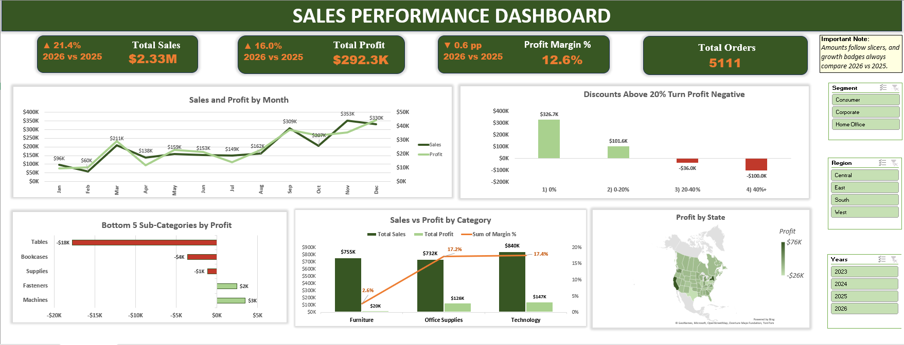

# Superstore Sales Dashboard (Excel)

This is my Excel dashboard for the Superstore sales data (around 10K orders, 2023-2026). I wanted to see which products, discounts and regions drive profit, and which ones quietly eat it.

## The short story

Sales are growing, but profit is not keeping pace.

- **2026 sales rose 21.4%** over 2025, while **profit rose 16.0%**. Margin slipped from 13.5% to 12.9%.
- **Discounts above 20% are the biggest leak.** Those 1,415 order lines brought in $365K in sales and lost **$136K**. Orders with no discount earn a 29.6% margin; orders discounted 40%+ lose 77 cents on every dollar.
- **Furniture sells but barely earns.** It produces $755K in sales (the same scale as the other two categories) but only $20K profit, a 2.6% margin, against about 17% for Office Supplies and Technology.
- **Two products explain most of it.** Tables (−$17.8K) and Bookcases (−$3.6K) are the only big loss makers, and they also carry the heaviest discounts in the category (25.8% and 21.5% on average).
- **Geography matters too.** Texas (−$25.7K), Ohio (−$17.0K) and Pennsylvania (−$15.6K) are the largest loss-making states. By region, Central has the weakest margin (7.9%) and West the strongest (15.0%).

## Key numbers

| KPI | Value |
|---|---|
| Total Sales | $2.33M |
| Total Profit | $292.3K |
| Profit Margin | 12.6% |
| Total Orders | 5,111 (distinct Order IDs) |

Growth badges on the cards always compare 2026 vs 2025. The big numbers follow the slicers.

## What's on the dashboard

| Visual | What it shows |
|---|---|
| KPI cards | Sales, profit, margin, orders, with 2026 vs 2025 change |
| Sales and Profit by Month | Seasonality: sales build through the year and peak in Q4 |
| Discounts Above 20% Turn Profit Negative | Profit by discount band |
| Bottom 5 Sub-Categories by Profit | Tables, Bookcases and Supplies lose money |
| Sales vs Profit by Category | Revenue, profit and margin side by side |
| Profit by State | Map of profit and loss by state |
| Slicers | Segment, Region, Years |

## Recommendations

1. **Cap discounts at 20%.** Nothing above that threshold is profitable on average. This is the single biggest lever on the dashboard.
2. **Review Table and Bookcase pricing.** Their losses are larger than all of Furniture's profit. Fixing them would change the category's margin picture.
3. **Look closer at Texas, Ohio and Pennsylvania.** Check whether the losses come from discounting, product mix or shipping costs.
4. **Don't judge categories by sales alone.** Technology earns $147K on $840K of sales; Furniture earns $20K on $755K.

## How it was built

1. **Data cleaning:** removed 10 duplicate rows and one blank row, converted Order Date from text to a real date, fixed number formats, standardized fonts and headers.
2. **PivotTables:** sales and profit by sub-category, category, region, ship mode, year and discount band.
3. **Lookups:** Regional Manager (INDEX-MATCH and XLOOKUP cross-checked), Supplier, Unit Cost, Target Margin, and a VLOOKUP flag for returned orders.
4. **Calculated fields:** Profit Status (IF), Discount Level (nested IF), Margin Category (IFS), Discount Band, plus SUMIFS/COUNTIFS summaries by region.
5. **Dashboard:** PivotCharts, KPI cards linked to cells, three connected slicers and conditional formatting (green for profit, red for loss).

## Things I learned along the way

- A helper column that counted only single-line orders made Total Orders show 2,593 instead of 5,111. Distinct counts on Order ID fixed it. Always reconcile a KPI against the raw data.
- Quarter and month views that combine all years show seasonality, not trend. I labelled them honestly and used year-over-year for the growth badges.
- Chart titles should state the finding, not just describe the chart.

## Files

| File | Content |
|---|---|
| Checkpoint-1.xlsx | Data cleaning |
| Checkpoint-2.xlsx | Pivot tables |
| Checkpoint-3.xlsb | Lookup formulas |
| Checkpoint-4.xlsb | Calculated fields |
| Checkpoint-5.xlsb | Final dashboard |
| Screenshot.png | Dashboard preview |

**Tools:** Excel (PivotTables, PivotCharts, slicers, XLOOKUP, INDEX-MATCH, IFS, SUMIFS)

**Author:** Zahra Aliyeva
